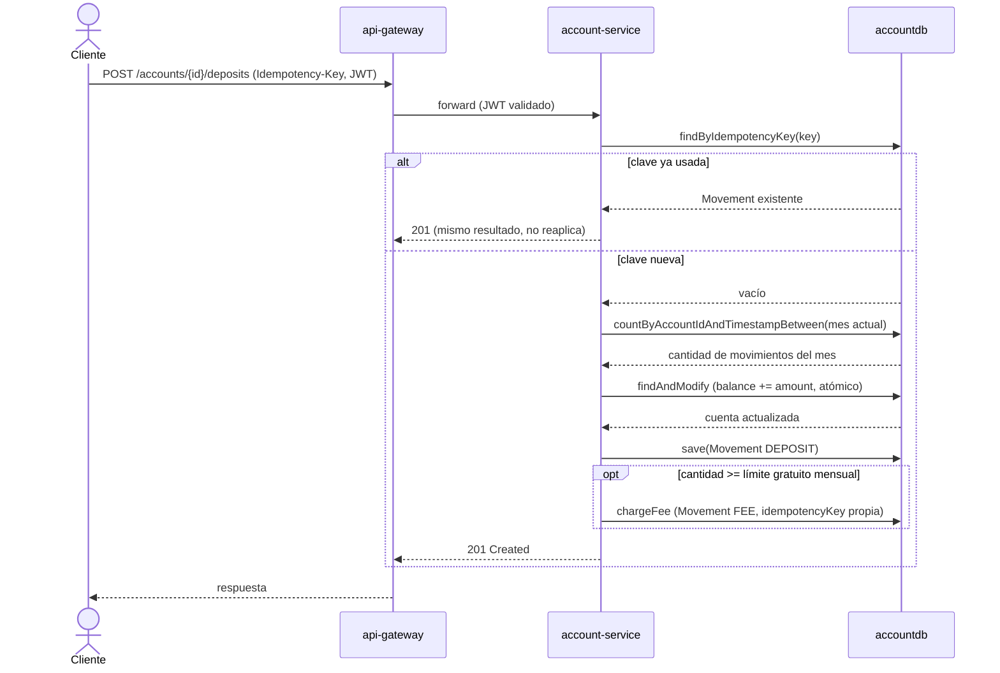
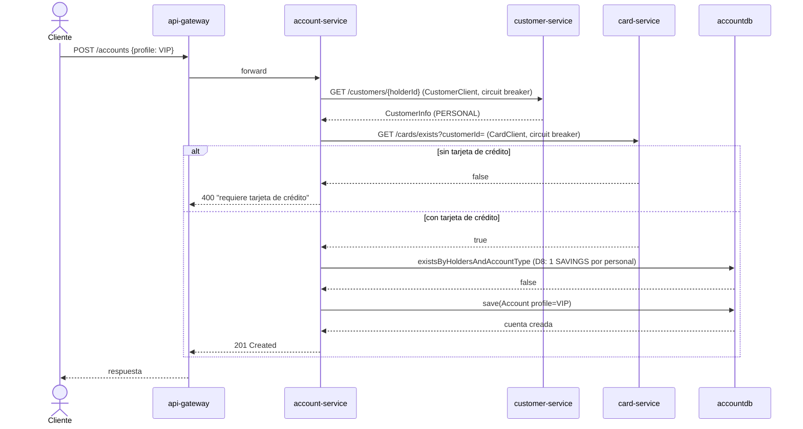
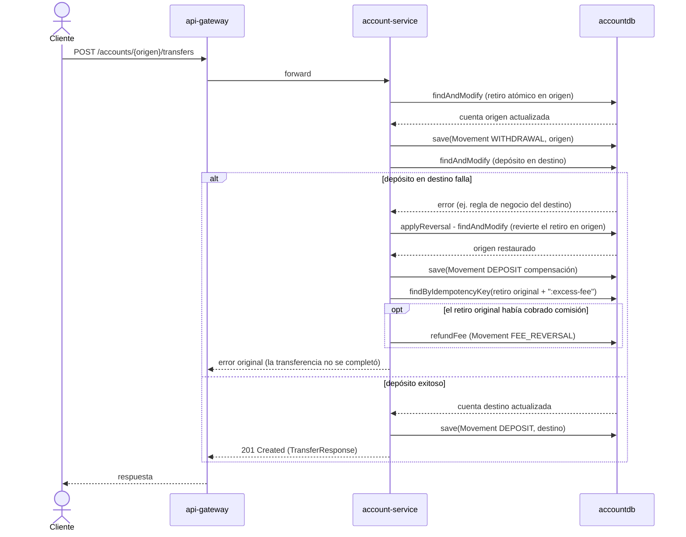
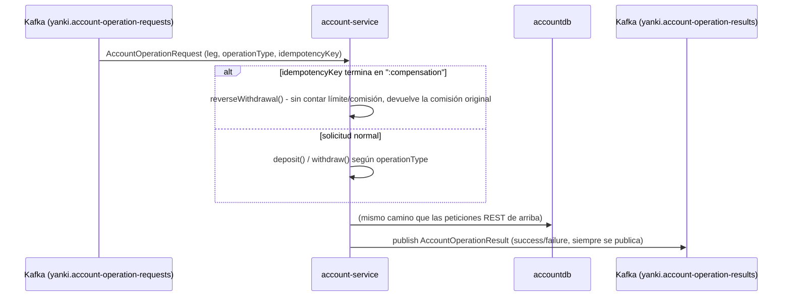

# Diagramas de secuencia — account-service

Requerimiento no funcional (Parte I): *"Elaborar diagramas de secuencia de cada microservicio."*

## Depósito con Idempotency-Key (incluida la comisión por exceso de movimientos)

Todo movimiento de dinero pasa por la misma pata (`executeLeg`): valida el límite mensual
gratuito, aplica el update atómico de saldo, registra el movimiento y cobra la comisión si
corresponde — nunca lectura+escritura separada sobre el saldo.

## Alta de cuenta VIP (validación cross-service síncrona)

Crear una cuenta VIP exige que el cliente ya tenga tarjeta de crédito (D5) — resuelto con
llamadas REST protegidas por circuit breaker + timeout de 2s, porque `account-service` no es un
microservicio nuevo (la restricción "sin REST" de Fase III no le aplica).

## Transferencia con compensación (Saga local, D6/D7)

Si el depósito en destino falla después del retiro en origen, se revierte con un depósito
compensatorio — incluida la devolución de cualquier comisión que el retiro original haya
disparado (hallazgo 8.7, `reverseWithdrawal`: la reversión no cuenta para el límite/comisión ni
para el bloqueo de día de una cuenta a plazo fijo).

## Pata de transferencia pedida por yanki-service (coreografía Kafka)

`account-service` no es un microservicio nuevo, pero expone esta pata para que `yanki-service`
(que sí lo es) mueva plata real sin llamarlo por REST — reutiliza los mismos métodos públicos
`deposit()`/`withdraw()`/`reverseWithdrawal()` de arriba, invocados desde un consumer de Kafka en
vez de un controller HTTP.

